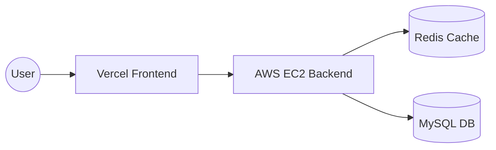

# ✂️ SnipShort — High Performance URL Shortener


A blazing-fast URL shortener featuring **sub-millisecond redirects** via Redis caching, **Google OAuth**, and **real-time analytics**. Built for performance and scale.

---

## 📸 Screenshots

| Landing Page | Dashboard | Login |
|:---:|:---:|:---:|
|  |  |  |

---

## ✨ Key Features

- ⚡ **Sub-ms Redirects** — Multi-layer caching strategy with Redis.
- 🔑 **Flexible Auth** — Google OAuth 2.0 & JWT-based Email/Password.
- 📊 **Live Analytics** — Track click counts, referrers, and user agents.
- 🏷️ **Custom Aliases** — Brand your links with custom slugs.
- 🛡️ **Anti-Abuse** — Redis-backed rate limiting on all endpoints.
- 🕒 **Temporary Links** — Guest mode allows creating links that expire in 24h.
- 🐳 **Cloud Ready** — Fully containerised with Docker & Docker Compose.

---

## 🏗️ Architecture



- **Frontend:** Hosted on Vercel for global edge delivery.
- **Backend:** Dockerized Node.js on AWS EC2.
- **Caching:** Redis stores hot links to bypass DB lookups for 95%+ of traffic.

---

## 🛠️ Tech Stack

| Layer | Technology |
|---|---|
| **Frontend** | React 18, Vite, TailwindCSS, date-fns |
| **Backend** | Node.js 20, Express, Passport.js, Sequelize |
| **Storage** | MySQL 8, Redis 7 (Alpine) |
| **DevOps** | Docker, Docker Compose, GitHub Actions |

---

## 🚀 Quick Start (Local)

1. **Clone & Env:**
   ```bash
   git clone https://github.com/RulerDevansh/Snip_UrlShortner.git
   cd Snip_UrlShortner
   cp .env.example .env
   ```
2. **Launch Containers:**
   ```bash
   docker-compose up -d
   ```
3. **Access:**
   - Frontend: `http://localhost:5173`
   - Backend: `http://localhost:3000`

---

## 🤝 Credits
Made with ❤️ by [RulerDevansh](https://github.com/RulerDevansh)
